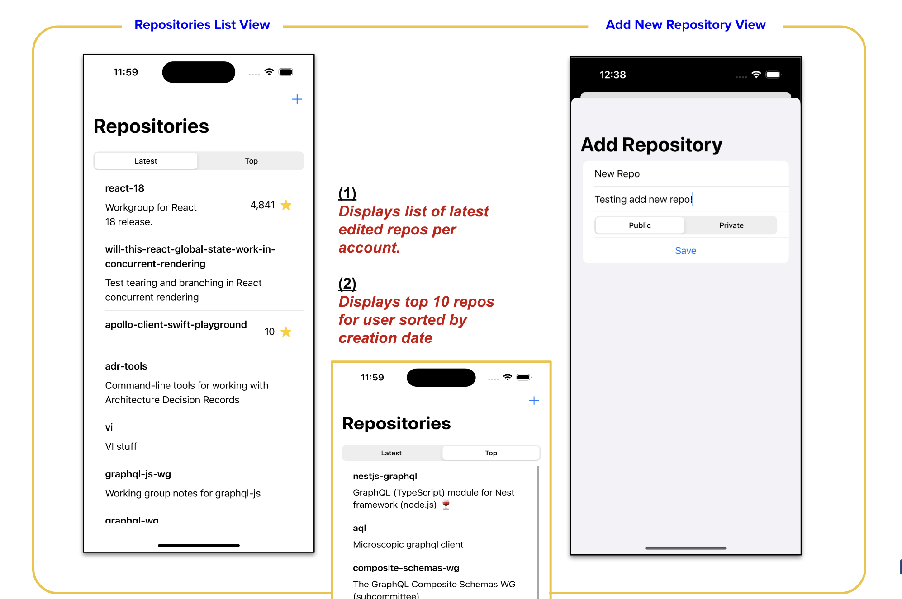
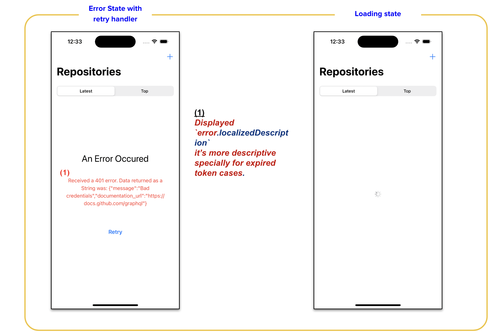

# graphql-github-app

In case the app displays error on loading, that would mean the used GitHub access token has been expired! 
To make it work please visit `https://github.com/settings/tokens` and generate new acccess token and then paste in inside `Constants.swift` file to e able to test the app smoothly.

Also, you can always change the username to any github user and it will fetch their repos.

## How the app looks like on loaded state

## How the app looks like on error state and loading state

